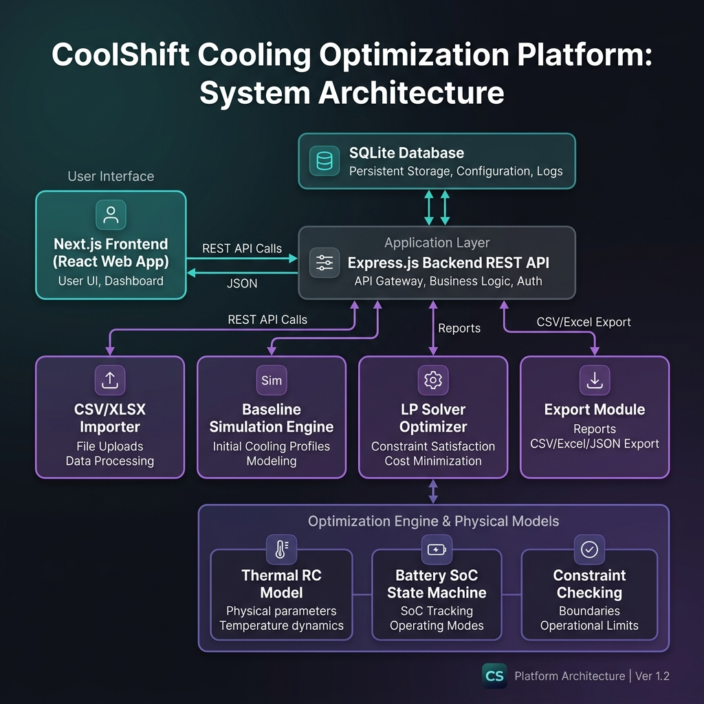

# CoolShift Platform Architecture

The following diagram illustrates the data flow, architecture layers, and service modules of the CoolShift Optimization Platform:



## Detailed Flow Diagram (Mermaid)

```mermaid
graph TD
    User["User Web Browser"]
    Frontend["Next.js Frontend (Port 3000)"]
    Backend["Express.js REST API (Port 4000)"]
    
    subgraph API Modules
        Importer["CSV/XLSX Importer"]
        Baseline["Baseline Simulation Engine"]
        Optimizer["Linear Programming Optimizer (LP Solver)"]
        Export["Regulatory Export Module (CSV/XLSX)"]
    end

    subgraph Core Physics & Solver
        Thermal["Thermal Resistance-Capacitance Model"]
        Battery["Battery SoC State Machine"]
        Constraints["Constraint Checking Engine"]
        Reason["Reason Code Allocator"]
    end

    DB[("SQLite Database (better-sqlite3)")]

    %% Connections
    User <-->|HTTP / REST| Frontend
    Frontend <-->|JSON API / Axios| Backend
    
    Backend --> Importer
    Backend --> Baseline
    Backend --> Optimizer
    Backend --> Export
    
    Importer -->|Write Inputs| DB
    Baseline -->|Write Baseline Run| DB
    Export <-- |Query Outcomes| DB
    
    Optimizer -->|Evaluate Hard Constraints| Constraints
    Optimizer -->|State Transition| Battery
    Optimizer -->|Enforce Boundaries| Thermal
    Optimizer -->|Operational Labels| Reason
    
    Optimizer -->|Write Solver Runs & output_schedule| DB
    Baseline -->|Simulation Steps| Thermal
    
```
